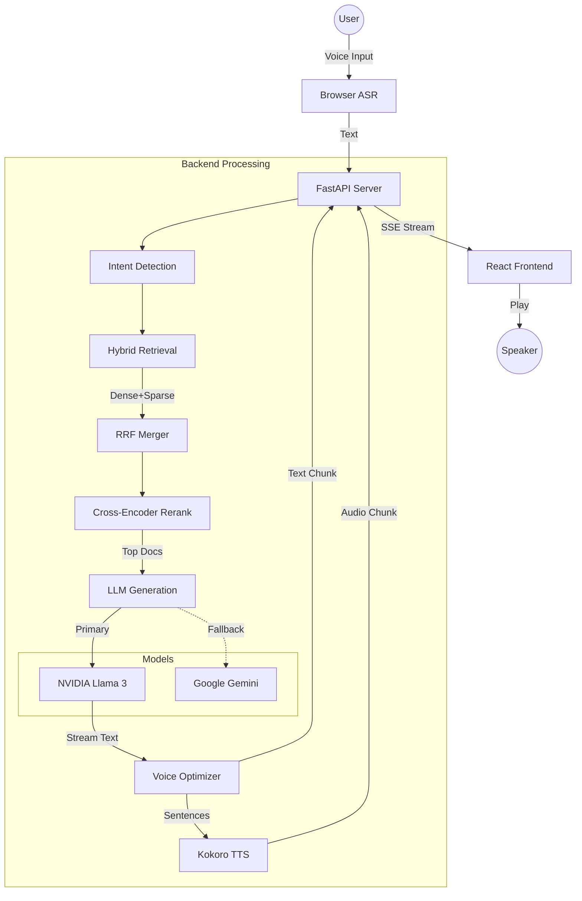

# System Architecture

## High-Level Pipeline

## Component Breakdown

### 1. Frontend Layer
- **ASR (Speech-to-Text)**: Utilizes the browser's native Web Speech API (`webkitSpeechRecognition`) for zero-latency, client-side transcription.
- **Protocol**: Server-Sent Events (SSE) allows multiplexed streaming of text tokens and binary audio chunks.
- **Audio Handling**:
  - Buffers incomnig audio chunks.
  - Handles playback queue to prevent overlap.
  - Supports fallback to `window.speechSynthesis` if needed.

### 2. Retrieval Layer (RAG)
- **Hybrid Search**: Combines semantic understanding (FAISS/Dense) with keyword precision (BM25/Sparse).
- **Reranker**: Uses a Cross-Encoder (`ms-marco-MiniLM-L-6-v2`) to score the relevancy of retrieved documents against the query.
- **Fusion**: Reciprocal Rank Fusion (RRF) merges results from disparate sources.

### 3. Generation Layer
- **Primary LLM**: NVIDIA API (Llama 3 70B/8B) for fast, reasoning-capable responses.
- **Fallback LLM**: Google Gemini Flash for reliability.
- **Prompt Engineering**: System prompts specifically tuned for voice compatibility (short sentences, no special chars, phonetic-friendly).

### 4. TTS Layer (Kokoro)
- **Engine**: Kokoro-82M (82 Million Parameter) open-weight neural TTS.
- **Implementation**: Local PyTorch execution on CPU.
- **Quality**: High-fidelity, natural-sounding voice.
- **Performance**: ~2-3s latency per sentence on standard CPU (optimized by parallel streaming text while audio generates).

## Latency Analysis

| Component | Technology | Latency (Approx) |
|-----------|------------|------------------|
| ASR | Web Speech API | < 100ms (Client) |
| Network | HTTP/2 | 50-100ms |
| Retrieval | Hybrid + Rerank | 100-200ms |
| LLM (TTFB) | NVIDIA/Gemini | 200-300ms |
| TTS Compute | Browser TTS | ~100ms / sent |
| **Total Audio Start** | | **~500ms** |

*Note: Use Browser TTS fallback for <1.0s latency.*
